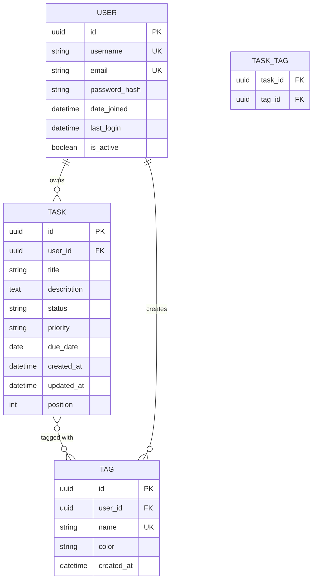

# Data Models

## Entity Relationship Diagram



## Model Specifications

### User Model

**Extends**: Django's `AbstractUser`

**Purpose**: User authentication and account management

```python
from django.contrib.auth.models import AbstractUser
from django.db import models
import uuid

class User(AbstractUser):
    """
    Custom user model extending Django's AbstractUser.
    Uses UUID primary key for security and scalability.
    """
    id = models.UUIDField(primary_key=True, default=uuid.uuid4, editable=False)
    email = models.EmailField(unique=True)

    # Django's AbstractUser provides:
    # - username (unique)
    # - first_name, last_name
    # - password (hashed with Argon2)
    # - is_staff, is_active, is_superuser
    # - date_joined, last_login

    USERNAME_FIELD = 'username'
    REQUIRED_FIELDS = ['email']

    class Meta:
        db_table = 'users'
        verbose_name = 'User'
        verbose_name_plural = 'Users'

    def __str__(self):
        return self.username
```

**Fields**:

| Field | Type | Constraints | Purpose |
|-------|------|-------------|---------|
| id | UUID | PK, auto-generated | Unique identifier |
| username | String(150) | Unique, indexed | Login identifier |
| email | EmailField(254) | Unique, indexed | Email address (for password reset) |
| password | String(128) | Hashed (Argon2) | Authentication credential |
| first_name | String(150) | Optional | Personalization |
| last_name | String(150) | Optional | Personalization |
| is_active | Boolean | Default: True | Account status |
| is_staff | Boolean | Default: False | Admin access |
| date_joined | DateTime | Auto-set | Account creation timestamp |
| last_login | DateTime | Auto-updated | Last login tracking |

**Indexes**:
- `username` (unique)
- `email` (unique)

**Business Rules**:
- Email must be unique across all users
- Password must meet complexity requirements (via forms)
- Username is case-sensitive
- Inactive users cannot log in

---

### Task Model

**Purpose**: Core to-do item with status tracking

```python
from django.db import models
from django.conf import settings
import uuid

class Task(models.Model):
    """
    Task model representing a single to-do item.
    Belongs to a user and can have multiple tags.
    """

    STATUS_CHOICES = [
        ('todo', 'To Do'),
        ('in_progress', 'In Progress'),
        ('done', 'Done'),
    ]

    PRIORITY_CHOICES = [
        ('low', 'Low'),
        ('medium', 'Medium'),
        ('high', 'High'),
    ]

    id = models.UUIDField(primary_key=True, default=uuid.uuid4, editable=False)
    user = models.ForeignKey(
        settings.AUTH_USER_MODEL,
        on_delete=models.CASCADE,
        related_name='tasks'
    )
    title = models.CharField(max_length=200)
    description = models.TextField(blank=True)
    status = models.CharField(
        max_length=20,
        choices=STATUS_CHOICES,
        default='todo',
        db_index=True
    )
    priority = models.CharField(
        max_length=10,
        choices=PRIORITY_CHOICES,
        default='medium',
        db_index=True
    )
    due_date = models.DateField(null=True, blank=True)
    position = models.IntegerField(default=0, help_text="For manual ordering")
    tags = models.ManyToManyField('Tag', related_name='tasks', blank=True)

    created_at = models.DateTimeField(auto_now_add=True)
    updated_at = models.DateTimeField(auto_now=True)

    class Meta:
        db_table = 'tasks'
        ordering = ['position', '-created_at']
        indexes = [
            models.Index(fields=['user', 'status']),
            models.Index(fields=['user', 'priority']),
            models.Index(fields=['user', 'due_date']),
            models.Index(fields=['user', 'created_at']),
        ]

    def __str__(self):
        return f"{self.title} ({self.get_status_display()})"

    def is_overdue(self):
        """Check if task is overdue."""
        from django.utils import timezone
        return self.due_date and self.due_date < timezone.now().date() and self.status != 'done'
```

**Fields**:

| Field | Type | Constraints | Purpose |
|-------|------|-------------|---------|
| id | UUID | PK | Unique identifier |
| user | ForeignKey | FK to User, CASCADE | Task owner |
| title | String(200) | Required | Task name |
| description | Text | Optional | Detailed description |
| status | String(20) | Choices, indexed | todo/in_progress/done |
| priority | String(10) | Choices, indexed | low/medium/high |
| due_date | Date | Optional | Deadline |
| position | Integer | Default: 0 | Manual sort order |
| tags | ManyToMany | To Tag | Associated tags |
| created_at | DateTime | Auto-set | Creation timestamp |
| updated_at | DateTime | Auto-update | Last modification |

**Indexes**:
- `(user, status)` - Filter by user's tasks with status
- `(user, priority)` - Filter by user's tasks with priority
- `(user, due_date)` - Filter by user's tasks by deadline
- `(user, created_at)` - Sort user's tasks by creation date

**Business Rules**:
- Title is required and cannot be empty
- Status must be one of: todo, in_progress, done
- Priority must be one of: low, medium, high
- Tasks are soft-deleted (not implemented in MVP)
- Maximum 5 tags per task (enforced in forms/serializers)
- Position is user-managed for custom ordering

---

### Tag Model

**Purpose**: Categorization and relationship visualization

```python
from django.db import models
from django.conf import settings
import uuid

class Tag(models.Model):
    """
    Tag model for categorizing tasks.
    Owned by a user, reusable across their tasks.
    """

    COLOR_CHOICES = [
        ('#FF6B6B', 'Red'),
        ('#4ECDC4', 'Teal'),
        ('#45B7D1', 'Blue'),
        ('#FFA07A', 'Orange'),
        ('#98D8C8', 'Mint'),
        ('#F7DC6F', 'Yellow'),
        ('#BB8FCE', 'Purple'),
        ('#85C1E2', 'Sky Blue'),
    ]

    id = models.UUIDField(primary_key=True, default=uuid.uuid4, editable=False)
    user = models.ForeignKey(
        settings.AUTH_USER_MODEL,
        on_delete=models.CASCADE,
        related_name='tags'
    )
    name = models.CharField(max_length=50)
    color = models.CharField(
        max_length=7,
        choices=COLOR_CHOICES,
        default='#4ECDC4'
    )
    created_at = models.DateTimeField(auto_now_add=True)

    class Meta:
        db_table = 'tags'
        ordering = ['name']
        unique_together = [['user', 'name']]
        indexes = [
            models.Index(fields=['user', 'name']),
        ]

    def __str__(self):
        return f"{self.name} ({self.color})"

    def get_task_count(self):
        """Return number of tasks with this tag."""
        return self.tasks.count()
```

**Fields**:

| Field | Type | Constraints | Purpose |
|-------|------|-------------|---------|
| id | UUID | PK | Unique identifier |
| user | ForeignKey | FK to User, CASCADE | Tag owner |
| name | String(50) | Required | Tag label |
| color | String(7) | Choices, hex code | Display color |
| created_at | DateTime | Auto-set | Creation timestamp |

**Indexes**:
- `(user, name)` - Unique constraint + fast lookup

**Business Rules**:
- Tag names are unique per user (case-insensitive enforced in forms)
- Tag names cannot be empty or whitespace-only
- Maximum 50 characters for tag name
- Color must be a valid hex code from predefined choices
- Deleting a tag removes it from all associated tasks (ManyToMany cascade)

---

## Model Relationships

### Task-Tag Relationship (ManyToMany)

**Database Table**: `task_tags` (auto-generated by Django)

**Structure**:
```sql
CREATE TABLE task_tags (
    id BIGSERIAL PRIMARY KEY,
    task_id UUID NOT NULL REFERENCES tasks(id) ON DELETE CASCADE,
    tag_id UUID NOT NULL REFERENCES tags(id) ON DELETE CASCADE,
    UNIQUE(task_id, tag_id)
);

CREATE INDEX idx_task_tags_task ON task_tags(task_id);
CREATE INDEX idx_task_tags_tag ON task_tags(tag_id);
```

**Query Optimization**:

```python
# GOOD: Prefetch tags to avoid N+1 queries
tasks = Task.objects.filter(user=request.user).prefetch_related('tags')

# BAD: N+1 query problem
tasks = Task.objects.filter(user=request.user)
for task in tasks:
    print(task.tags.all())  # Separate query for each task!
```

### User-Task Relationship (OneToMany)

**Cascade Behavior**: Deleting a user deletes all their tasks (CASCADE)

**Query Optimization**:

```python
# GOOD: Use select_related for foreign key
task = Task.objects.select_related('user').get(id=task_id)

# GOOD: Filter with user to avoid permission issues
tasks = Task.objects.filter(user=request.user)
```

### User-Tag Relationship (OneToMany)

**Cascade Behavior**: Deleting a user deletes all their tags (CASCADE)

**Query Optimization**:

```python
# GOOD: Annotate with task count
from django.db.models import Count

tags = Tag.objects.filter(user=request.user).annotate(
    task_count=Count('tasks')
)
```

## Data Validation Rules

### Task Validation

```python
from django.core.exceptions import ValidationError

def clean_task(task):
    """Validate task data before saving."""
    # Title cannot be empty or whitespace
    if not task.title or not task.title.strip():
        raise ValidationError("Title cannot be empty")

    # Due date cannot be in the past (for new tasks)
    if task.due_date and task.due_date < timezone.now().date() and not task.pk:
        raise ValidationError("Due date cannot be in the past")

    # Maximum 5 tags per task
    if task.pk and task.tags.count() > 5:
        raise ValidationError("Task cannot have more than 5 tags")
```

### Tag Validation

```python
def clean_tag(tag):
    """Validate tag data before saving."""
    # Tag name cannot be empty or whitespace
    if not tag.name or not tag.name.strip():
        raise ValidationError("Tag name cannot be empty")

    # Tag name must be unique per user (case-insensitive)
    existing = Tag.objects.filter(
        user=tag.user,
        name__iexact=tag.name
    ).exclude(pk=tag.pk)

    if existing.exists():
        raise ValidationError(f"Tag '{tag.name}' already exists")
```

## Database Constraints

### Primary Key Strategy

**UUIDs for all models**:
- **Security**: Prevents enumeration attacks (can't guess IDs)
- **Scalability**: Globally unique, supports distributed systems
- **Performance**: PostgreSQL handles UUIDs efficiently with proper indexes

```sql
-- UUID generation in PostgreSQL
CREATE EXTENSION IF NOT EXISTS "uuid-ossp";

-- Example task table
CREATE TABLE tasks (
    id UUID PRIMARY KEY DEFAULT uuid_generate_v4(),
    ...
);
```

### Foreign Key Constraints

All foreign keys use `ON DELETE CASCADE`:
- Deleting a user deletes all their tasks and tags
- Deleting a tag removes it from task_tags join table
- Deleting a task removes entries from task_tags join table

### Unique Constraints

| Model | Fields | Purpose |
|-------|--------|---------|
| User | username | Prevent duplicate usernames |
| User | email | Prevent duplicate emails |
| Tag | (user, name) | Prevent duplicate tag names per user |
| Task-Tag | (task_id, tag_id) | Prevent duplicate tag assignments |

### Check Constraints

```python
from django.db import models

class Task(models.Model):
    # ... fields ...

    class Meta:
        constraints = [
            models.CheckConstraint(
                check=models.Q(title__length__gt=0),
                name='task_title_not_empty'
            ),
            models.CheckConstraint(
                check=models.Q(position__gte=0),
                name='task_position_non_negative'
            ),
        ]
```

## Query Patterns and Best Practices

### Common Query Patterns

**Get user's tasks with tags**:
```python
tasks = Task.objects.filter(user=request.user).prefetch_related('tags')
```

**Get tasks by status**:
```python
todo_tasks = Task.objects.filter(user=request.user, status='todo')
```

**Get overdue tasks**:
```python
from django.utils import timezone

overdue = Task.objects.filter(
    user=request.user,
    due_date__lt=timezone.now().date(),
    status__in=['todo', 'in_progress']
)
```

**Get tasks with specific tag**:
```python
tagged_tasks = Task.objects.filter(user=request.user, tags__name='urgent')
```

**Get tag usage statistics**:
```python
from django.db.models import Count

tag_stats = Tag.objects.filter(user=request.user).annotate(
    task_count=Count('tasks')
).order_by('-task_count')
```

### Performance Optimization

**Use select_related for ForeignKey**:
```python
# GOOD: 1 query
task = Task.objects.select_related('user').get(id=task_id)

# BAD: 2 queries
task = Task.objects.get(id=task_id)
print(task.user.username)  # Extra query!
```

**Use prefetch_related for ManyToMany**:
```python
# GOOD: 2 queries total (tasks + tags)
tasks = Task.objects.filter(user=request.user).prefetch_related('tags')

# BAD: N+1 queries (1 for tasks, 1 per task for tags)
tasks = Task.objects.filter(user=request.user)
for task in tasks:
    print(task.tags.all())  # Extra query per task!
```

**Use only() and defer() for large querysets**:
```python
# Only fetch needed fields
tasks = Task.objects.filter(user=request.user).only('id', 'title', 'status')
```

## Migration Strategy

### Initial Migration

```python
# tasks/migrations/0001_initial.py
from django.db import migrations, models
import uuid

class Migration(migrations.Migration):
    initial = True

    dependencies = [
        ('auth', '0012_alter_user_first_name_max_length'),
    ]

    operations = [
        migrations.CreateModel(
            name='User',
            fields=[
                ('id', models.UUIDField(primary_key=True, default=uuid.uuid4)),
                # ... other fields
            ],
            options={'db_table': 'users'},
        ),
        migrations.CreateModel(
            name='Task',
            # ...
        ),
        migrations.CreateModel(
            name='Tag',
            # ...
        ),
        migrations.AddIndex(
            model_name='task',
            index=models.Index(fields=['user', 'status']),
        ),
        # ... other indexes
    ]
```

### Data Migration Example

```python
# tasks/migrations/0002_add_default_tags.py
from django.db import migrations

def create_default_tags(apps, schema_editor):
    """Create default tags for existing users."""
    Tag = apps.get_model('tasks', 'Tag')
    User = apps.get_model('accounts', 'User')

    default_tags = [
        {'name': 'Work', 'color': '#FF6B6B'},
        {'name': 'Personal', 'color': '#4ECDC4'},
        {'name': 'Urgent', 'color': '#FFA07A'},
    ]

    for user in User.objects.all():
        for tag_data in default_tags:
            Tag.objects.get_or_create(
                user=user,
                name=tag_data['name'],
                defaults={'color': tag_data['color']}
            )

class Migration(migrations.Migration):
    dependencies = [
        ('tasks', '0001_initial'),
    ]

    operations = [
        migrations.RunPython(create_default_tags),
    ]
```

## Model Methods and Properties

### Task Model Methods

```python
class Task(models.Model):
    # ... fields ...

    @property
    def is_overdue(self):
        """Check if task is overdue."""
        from django.utils import timezone
        return (
            self.due_date and
            self.due_date < timezone.now().date() and
            self.status != 'done'
        )

    @property
    def days_until_due(self):
        """Calculate days until due date."""
        from django.utils import timezone
        if not self.due_date:
            return None
        delta = self.due_date - timezone.now().date()
        return delta.days

    def get_related_tasks(self):
        """Get tasks sharing tags with this task."""
        return Task.objects.filter(
            user=self.user,
            tags__in=self.tags.all()
        ).exclude(id=self.id).distinct()
```

### Tag Model Methods

```python
class Tag(models.Model):
    # ... fields ...

    @property
    def task_count(self):
        """Return cached task count."""
        return self.tasks.count()

    def get_related_tags(self):
        """Get tags that frequently appear with this tag."""
        from django.db.models import Count
        return Tag.objects.filter(
            tasks__tags=self
        ).exclude(id=self.id).annotate(
            shared_count=Count('tasks')
        ).order_by('-shared_count')[:5]
```
