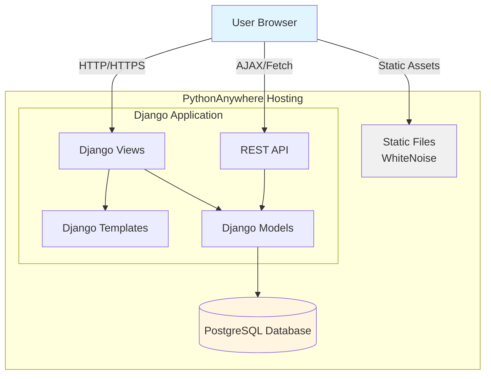
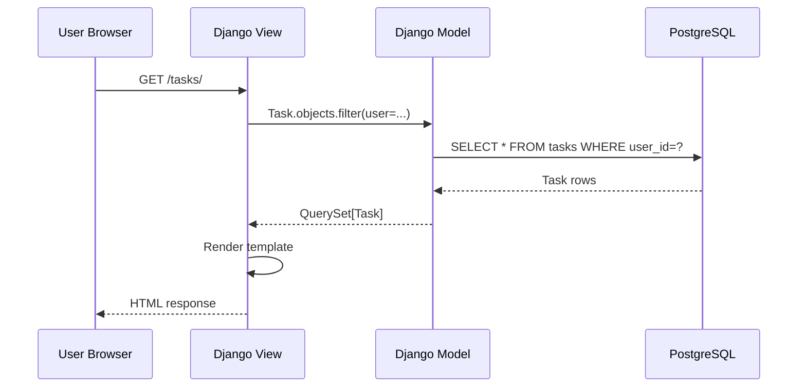
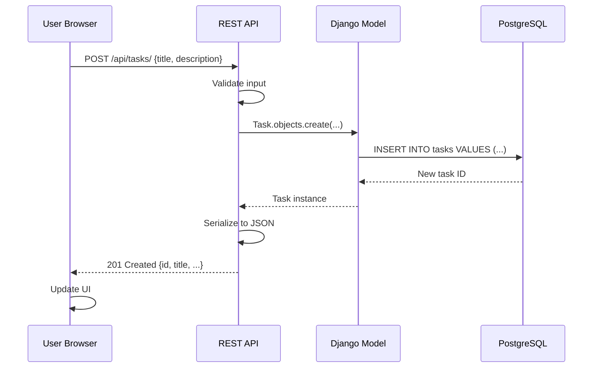
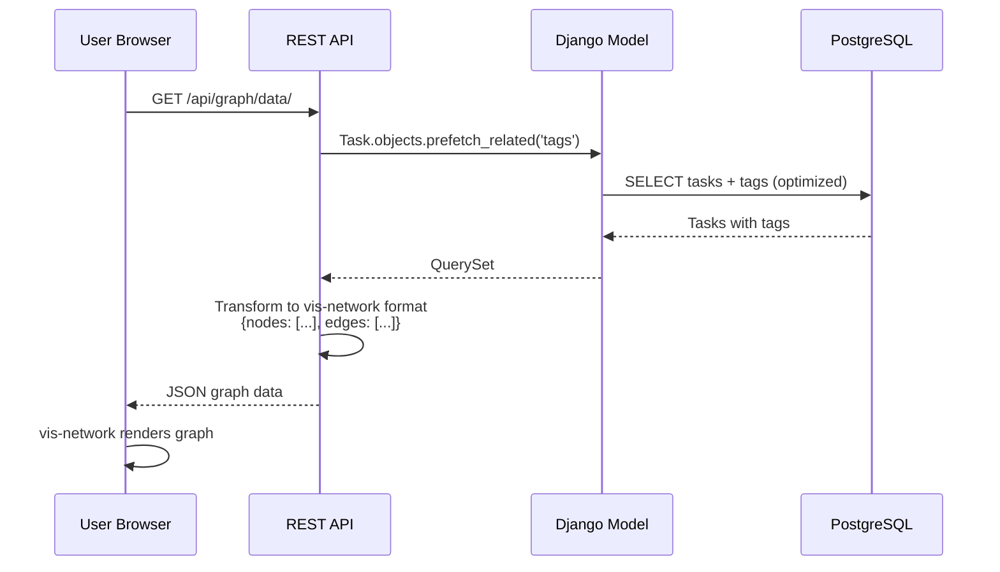
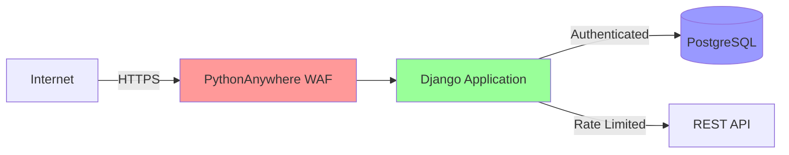

# High-Level Architecture

## System Overview

The Django To-Do Application follows a **monolithic architecture** with clear separation between frontend and backend concerns, deployed as a single Django application on PythonAnywhere.

## Architecture Pattern

**Monolithic Django Application** with:

- **Server-Side Rendering**: Django templates for initial page load
- **Client-Side Enhancement**: Alpine.js for interactivity
- **API Layer**: Django REST Framework for AJAX operations
- **Single Database**: PostgreSQL for all data persistence

### Rationale

- **PRD Requirement**: PythonAnywhere hosting limits deployment options
- **Team Velocity**: Single codebase, single deployment, faster iteration
- **Complexity Match**: 1000-user target doesn't justify microservices overhead
- **Django Strengths**: Built-in admin, ORM, authentication, static file handling

## Component Layers

### 1. Presentation Layer

**Technologies**: HTML5, Alpine.js, Bootstrap 5.3, vis-network

**Responsibilities**:
- Render task lists, forms, and network graph
- Handle user interactions (create, edit, delete tasks)
- Manage client-side state for graph visualization
- Display real-time validation feedback

**Communication**:
- Server-rendered initial HTML from Django views
- AJAX calls to REST API for dynamic updates

### 2. Application Layer

**Technologies**: Django 4.2, Django REST Framework

**Responsibilities**:
- Request routing and view logic
- Business rule enforcement (tag limits, task validation)
- Session management and authentication
- Template rendering with context data

**Communication**:
- Receives HTTP requests from presentation layer
- Calls data layer through Django ORM

### 3. Data Layer

**Technologies**: Django ORM, PostgreSQL 14+

**Responsibilities**:
- Data persistence and retrieval
- Query optimization (prefetch_related, select_related)
- Transaction management
- Database constraints and integrity

**Communication**:
- SQL queries via Django ORM
- Migration management through Django's migration system

### 4. Static Asset Layer

**Technologies**: WhiteNoise, Django Compressor

**Responsibilities**:
- Serve CSS, JavaScript, images
- Asset minification and compression
- Cache busting with hashed filenames

**Communication**:
- Direct HTTP requests from browser
- No application logic involved

## Data Flow Patterns

### Read Flow (Task List)

### Write Flow (Create Task)

### Graph Visualization Flow

## Deployment Model

**Single-Server Deployment** on PythonAnywhere:

- **Web Worker**: Runs Django application (WSGI)
- **Database**: PostgreSQL database (same server or managed)
- **Static Files**: Served via WhiteNoise (no separate CDN)
- **Background Tasks**: Scheduled tasks via PythonAnywhere scheduled tasks

### Scalability Considerations

For MVP (1000 users):
- ✅ Single-server sufficient
- ✅ Vertical scaling available on PythonAnywhere
- ✅ Database connection pooling via pgbouncer if needed

Future scaling paths (post-MVP):
- Horizontal scaling with multiple web workers
- Separate database server
- CDN for static assets
- Redis for caching and sessions

## Key Architectural Decisions

| Decision | Choice | Rationale |
|----------|--------|-----------|
| Architecture Pattern | Monolithic | PythonAnywhere hosting, team velocity, appropriate complexity |
| Frontend Framework | Alpine.js | Lightweight (15KB), no build step, progressive enhancement |
| API Style | REST | Standard, well-supported by DRF, client-agnostic |
| Database | PostgreSQL | Robust, good Django support, JSON field for future flexibility |
| Static File Serving | WhiteNoise | Django-native, no separate server needed, good performance |
| Session Storage | Database-backed | Simple, reliable, supports PythonAnywhere environment |
| Cache Strategy | Database-backed cache (MVP) | Start simple, add Redis post-MVP if needed |

## Security Boundaries

**Defense Layers**:
1. **Network**: HTTPS only, PythonAnywhere firewall
2. **Application**: Django CSRF, session security, input validation
3. **API**: Rate limiting, authentication required
4. **Database**: Parameterized queries (ORM), role-based access
5. **Data**: Password hashing (Argon2), sensitive data encryption

## Integration Points

| Integration | Type | Purpose |
|-------------|------|---------|
| vis-network | Client-side library | Graph visualization rendering |
| Django Admin | Built-in | Administrative interface |
| GitHub Actions | CI/CD | Automated testing and deployment |
| Sentry | Monitoring | Error tracking and performance monitoring |
| PythonAnywhere API | Deployment | Automated deployment triggers |

## Architecture Constraints

**From PRD**:
- ✅ Must deploy to PythonAnywhere
- ✅ Must support 1000 concurrent users (MVP)
- ✅ Must use PostgreSQL database
- ✅ Must complete in 8-week timeline

**Technical Constraints**:
- ✅ Python 3.10+ required for Django 4.2
- ✅ No WebSocket support on PythonAnywhere (use polling if needed)
- ✅ Static file storage on local filesystem (WhiteNoise)
- ✅ Background tasks limited to scheduled tasks (no Celery)

## Architecture Validation

This architecture satisfies all PRD requirements:

- ✅ **Epic 1 (Core Task Management)**: Django models + forms + views
- ✅ **Epic 2 (Tag System)**: ManyToMany relationship, tag autocomplete
- ✅ **Epic 3 (Network Graph)**: vis-network integration, graph API endpoint
- ✅ **Epic 4 (User Management)**: Django authentication + user isolation
- ✅ **Non-Functional Requirements**: Performance via DB optimization, security via Django best practices
