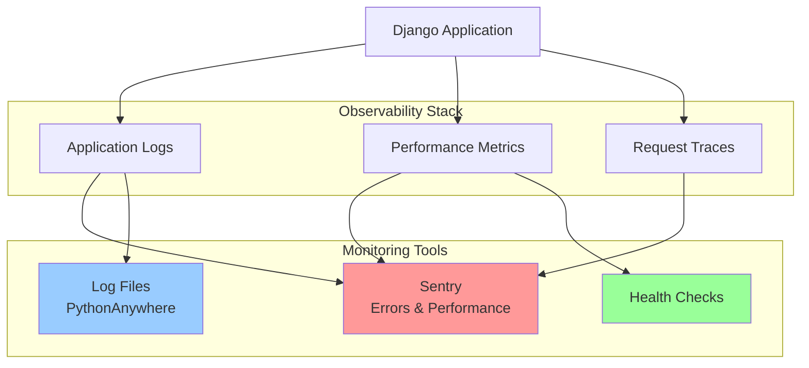

# Monitoring and Observability

## Observability Strategy

**Three Pillars of Observability**:

1. **Logs**: What happened and when
2. **Metrics**: How the system is performing
3. **Traces**: How requests flow through the system



---

## Logging

### Logging Levels

| Level | When to Use | Example |
|-------|-------------|---------|
| DEBUG | Detailed diagnostic info | Function entry/exit, variable values |
| INFO | General operational events | User login, task created, deployment |
| WARNING | Unexpected but handled | Deprecated API usage, rate limit approaching |
| ERROR | Error that needs attention | Failed API call, database error |
| CRITICAL | System failure | Database unavailable, critical service down |

### Logging Configuration

**Production** (`settings/production.py`):

```python
import os

LOGGING = {
    'version': 1,
    'disable_existing_loggers': False,

    'formatters': {
        'verbose': {
            'format': '{levelname} {asctime} {name} {module} {process:d} {thread:d} {message}',
            'style': '{',
        },
        'json': {
            '()': 'pythonjsonlogger.jsonlogger.JsonFormatter',
            'format': '%(asctime)s %(name)s %(levelname)s %(message)s %(pathname)s %(lineno)d',
        },
    },

    'filters': {
        'require_debug_false': {
            '()': 'django.utils.log.RequireDebugFalse',
        },
    },

    'handlers': {
        'console': {
            'level': 'INFO',
            'class': 'logging.StreamHandler',
            'formatter': 'verbose',
        },
        'file': {
            'level': 'INFO',
            'class': 'logging.handlers.RotatingFileHandler',
            'filename': os.path.join(BASE_DIR, 'logs/django.log'),
            'maxBytes': 1024 * 1024 * 10,  # 10 MB
            'backupCount': 5,
            'formatter': 'json',
        },
        'error_file': {
            'level': 'ERROR',
            'class': 'logging.handlers.RotatingFileHandler',
            'filename': os.path.join(BASE_DIR, 'logs/error.log'),
            'maxBytes': 1024 * 1024 * 10,
            'backupCount': 5,
            'formatter': 'json',
        },
        'sentry': {
            'level': 'ERROR',
            'class': 'sentry_sdk.integrations.logging.EventHandler',
        },
    },

    'root': {
        'handlers': ['console', 'file'],
        'level': 'INFO',
    },

    'loggers': {
        'django': {
            'handlers': ['console', 'file'],
            'level': 'INFO',
            'propagate': False,
        },
        'django.request': {
            'handlers': ['error_file', 'sentry'],
            'level': 'ERROR',
            'propagate': False,
        },
        'django.db.backends': {
            'handlers': ['file'],
            'level': 'WARNING',  # Log slow queries
            'propagate': False,
        },
        'apps': {
            'handlers': ['console', 'file', 'error_file'],
            'level': 'INFO',
            'propagate': False,
        },
        'apps.tasks': {
            'handlers': ['console', 'file', 'sentry'],
            'level': 'INFO',
            'propagate': False,
        },
    },
}
```

### Application Logging

**Structured Logging**:

```python
import logging

logger = logging.getLogger(__name__)

# Basic logging
logger.info('Task created', extra={
    'user_id': user.id,
    'task_id': task.id,
    'task_title': task.title,
})

# Error logging with traceback
try:
    task.save()
except Exception as e:
    logger.error(
        'Failed to save task',
        exc_info=True,
        extra={
            'user_id': user.id,
            'task_id': task.id,
            'error_type': type(e).__name__,
        }
    )
    raise

# Warning for business logic
if task.tags.count() > 5:
    logger.warning(
        'Task exceeds recommended tag count',
        extra={
            'task_id': task.id,
            'tag_count': task.tags.count(),
        }
    )
```

### Request Logging Middleware

```python
# apps/core/middleware.py
import logging
import time

logger = logging.getLogger(__name__)

class RequestLoggingMiddleware:
    """Log all HTTP requests with timing."""

    def __init__(self, get_response):
        self.get_response = get_response

    def __call__(self, request):
        # Start timing
        start_time = time.time()

        # Process request
        response = self.get_response(request)

        # Calculate duration
        duration = time.time() - start_time

        # Log request
        logger.info(
            'HTTP Request',
            extra={
                'method': request.method,
                'path': request.path,
                'status_code': response.status_code,
                'duration_ms': round(duration * 1000, 2),
                'user_id': request.user.id if request.user.is_authenticated else None,
                'ip_address': self.get_client_ip(request),
            }
        )

        return response

    @staticmethod
    def get_client_ip(request):
        """Get client IP address."""
        x_forwarded_for = request.META.get('HTTP_X_FORWARDED_FOR')
        if x_forwarded_for:
            ip = x_forwarded_for.split(',')[0]
        else:
            ip = request.META.get('REMOTE_ADDR')
        return ip
```

**Enable in settings**:

```python
MIDDLEWARE = [
    # ... other middleware
    'apps.core.middleware.RequestLoggingMiddleware',
]
```

---

## Metrics and Performance Monitoring

### Sentry Performance Monitoring

**Configuration**:

```python
import sentry_sdk
from sentry_sdk.integrations.django import DjangoIntegration

sentry_sdk.init(
    dsn=os.environ.get('SENTRY_DSN'),
    integrations=[DjangoIntegration()],

    # Performance monitoring
    traces_sample_rate=0.1,  # 10% of transactions
    profiles_sample_rate=0.1,  # 10% of transactions

    # Environment
    environment='production',
    release=os.environ.get('GIT_COMMIT_SHA', 'unknown'),

    # Privacy
    send_default_pii=False,

    # Error filtering
    ignore_errors=[
        'Http404',
        'PermissionDenied',
    ],
)
```

**Custom Performance Tracking**:

```python
from sentry_sdk import start_transaction

def process_task_batch(tasks):
    """Process multiple tasks with performance tracking."""
    with start_transaction(op="task", name="process_task_batch") as transaction:
        # Tag transaction
        transaction.set_tag("task_count", len(tasks))

        # Child span for database operations
        with transaction.start_child(op="db", description="Fetch tags"):
            tags = Tag.objects.filter(user=tasks[0].user)

        # Child span for processing
        with transaction.start_child(op="process", description="Process tasks"):
            for task in tasks:
                process_single_task(task)
```

### Custom Metrics Collection

```python
# apps/core/metrics.py
from django.core.cache import cache
from datetime import datetime, timedelta

class MetricsCollector:
    """Simple metrics collection."""

    @staticmethod
    def increment(metric_name, value=1):
        """Increment a counter metric."""
        cache_key = f'metric:{metric_name}'
        current = cache.get(cache_key, 0)
        cache.set(cache_key, current + value, timeout=3600)

    @staticmethod
    def gauge(metric_name, value):
        """Set a gauge metric."""
        cache_key = f'metric:{metric_name}'
        cache.set(cache_key, value, timeout=3600)

    @staticmethod
    def timing(metric_name, duration_ms):
        """Record a timing metric."""
        cache_key = f'metric:{metric_name}:timings'
        timings = cache.get(cache_key, [])
        timings.append(duration_ms)
        cache.set(cache_key, timings, timeout=3600)

# Usage
metrics = MetricsCollector()
metrics.increment('tasks.created')
metrics.gauge('tasks.total', Task.objects.count())
metrics.timing('api.response_time', 125.5)
```

---

## Health Checks

### Application Health Check

```python
# apps/core/views.py
from django.http import JsonResponse
from django.db import connection
from django.core.cache import cache
import logging

logger = logging.getLogger(__name__)

def health_check(request):
    """
    Comprehensive health check endpoint.
    Returns 200 if healthy, 503 if unhealthy.
    """
    health_status = {
        'status': 'healthy',
        'timestamp': datetime.now().isoformat(),
        'checks': {}
    }

    # Check database
    try:
        with connection.cursor() as cursor:
            cursor.execute("SELECT 1")
        health_status['checks']['database'] = 'ok'
    except Exception as e:
        logger.error(f'Database health check failed: {e}')
        health_status['status'] = 'unhealthy'
        health_status['checks']['database'] = 'error'

    # Check cache
    try:
        cache.set('health_check', 'ok', 10)
        cache.get('health_check')
        health_status['checks']['cache'] = 'ok'
    except Exception as e:
        logger.warning(f'Cache health check failed: {e}')
        health_status['checks']['cache'] = 'warning'

    # Check application
    try:
        from apps.tasks.models import Task
        Task.objects.count()
        health_status['checks']['application'] = 'ok'
    except Exception as e:
        logger.error(f'Application health check failed: {e}')
        health_status['status'] = 'unhealthy'
        health_status['checks']['application'] = 'error'

    # Return appropriate status code
    status_code = 200 if health_status['status'] == 'healthy' else 503

    return JsonResponse(health_status, status=status_code)

def readiness_check(request):
    """
    Readiness check for deployments.
    Returns 200 if ready to serve traffic.
    """
    try:
        # Quick database check
        with connection.cursor() as cursor:
            cursor.execute("SELECT 1")
        return JsonResponse({'status': 'ready'}, status=200)
    except Exception as e:
        logger.error(f'Readiness check failed: {e}')
        return JsonResponse({'status': 'not_ready'}, status=503)

def liveness_check(request):
    """
    Liveness check for container orchestration.
    Returns 200 if process is alive.
    """
    return JsonResponse({'status': 'alive'}, status=200)
```

**URL Configuration**:

```python
# todo_project/urls.py
urlpatterns = [
    path('health/', health_check, name='health-check'),
    path('health/ready/', readiness_check, name='readiness-check'),
    path('health/live/', liveness_check, name='liveness-check'),
    # ... other URLs
]
```

### Database Health Monitoring

```python
from django.db import connection

def check_database_performance():
    """Check database query performance."""
    with connection.cursor() as cursor:
        # Check connection count
        cursor.execute("""
            SELECT count(*)
            FROM pg_stat_activity
            WHERE datname = current_database()
        """)
        connection_count = cursor.fetchone()[0]

        # Check slow queries (if pg_stat_statements enabled)
        cursor.execute("""
            SELECT query, mean_exec_time, calls
            FROM pg_stat_statements
            WHERE mean_exec_time > 1000
            ORDER BY mean_exec_time DESC
            LIMIT 10
        """)
        slow_queries = cursor.fetchall()

    logger.info(
        'Database health check',
        extra={
            'connection_count': connection_count,
            'slow_query_count': len(slow_queries),
        }
    )

    return {
        'connection_count': connection_count,
        'slow_queries': slow_queries,
    }
```

---

## Error Tracking with Sentry

### Error Capture

**Automatic Error Capture**:

```python
# Sentry automatically captures:
# - Unhandled exceptions
# - 500 errors
# - Django request errors
```

**Manual Error Capture**:

```python
from sentry_sdk import capture_exception, capture_message, set_context, set_tag

try:
    process_payment(task)
except PaymentError as e:
    # Add context
    set_tag('payment_provider', 'stripe')
    set_context('task', {
        'id': str(task.id),
        'title': task.title,
        'user_id': str(task.user_id),
    })

    # Capture exception
    capture_exception(e)

    # Re-raise or handle
    raise
```

**Custom Messages**:

```python
from sentry_sdk import capture_message

# Warning message
if task.tags.count() > 10:
    capture_message(
        'Task has excessive tag count',
        level='warning',
        extras={
            'task_id': str(task.id),
            'tag_count': task.tags.count(),
        }
    )
```

### User Context

```python
from sentry_sdk import set_user

# Set user context (automatically added to all events)
set_user({
    'id': str(user.id),
    'username': user.username,
    'email': user.email,
})

# Clear user context
set_user(None)
```

### Release Tracking

```python
# settings/production.py
import os
import sentry_sdk

sentry_sdk.init(
    dsn=os.environ.get('SENTRY_DSN'),
    release=os.environ.get('GIT_COMMIT_SHA', 'unknown'),
    environment='production',
)
```

**CI/CD Release Creation**:

```bash
# .github/workflows/deploy.yml
- name: Create Sentry release
  env:
    SENTRY_AUTH_TOKEN: ${{ secrets.SENTRY_AUTH_TOKEN }}
  run: |
    sentry-cli releases new -p todo-app ${{ github.sha }}
    sentry-cli releases set-commits ${{ github.sha }} --auto
    sentry-cli releases finalize ${{ github.sha }}
    sentry-cli releases deploys ${{ github.sha }} new -e production
```

---

## Uptime Monitoring

### External Uptime Monitoring

**UptimeRobot Configuration**:

- **Monitor Type**: HTTP(s)
- **URL**: `https://yourusername.pythonanywhere.com/health/`
- **Interval**: 5 minutes
- **Expected Status**: 200
- **Timeout**: 30 seconds

**Alerts**:
- Email on downtime
- Slack notification (optional)
- SMS for critical services (optional)

### Response Time Monitoring

**Monitor**:
- Average response time
- 95th percentile response time
- Maximum response time

**Thresholds**:
- Warning: > 1 second (p95)
- Critical: > 3 seconds (p95)

---

## Alerting Strategy

### Alert Severity Levels

| Severity | Response Time | Examples |
|----------|---------------|----------|
| Critical | Immediate | Database down, 500 error spike, app crash |
| High | Within 1 hour | High error rate, slow queries, API failures |
| Medium | Within 4 hours | Elevated response times, warning logs |
| Low | Within 24 hours | Deprecated API usage, approaching limits |

### Alert Configuration

**Sentry Alerts**:

1. **High Error Rate**:
   - Condition: Error count > 10 in 5 minutes
   - Action: Email + Slack notification

2. **Performance Degradation**:
   - Condition: p95 response time > 2 seconds
   - Action: Email notification

3. **New Release Issues**:
   - Condition: New error types after deployment
   - Action: Email + Slack notification

**Custom Alerts**:

```python
# apps/core/monitoring.py
from django.core.mail import mail_admins

def alert_high_error_rate():
    """Check error rate and alert if threshold exceeded."""
    from apps.core.models import ErrorLog

    recent_errors = ErrorLog.objects.filter(
        created_at__gte=timezone.now() - timedelta(minutes=5)
    ).count()

    if recent_errors > 10:
        mail_admins(
            subject='High Error Rate Alert',
            message=f'Detected {recent_errors} errors in the last 5 minutes.',
        )
```

---

## Performance Dashboards

### Key Metrics to Track

**Application Metrics**:
- Requests per minute
- Average response time
- Error rate (%)
- Active users

**Database Metrics**:
- Query count
- Slow queries (> 100ms)
- Connection pool usage
- Database size

**Business Metrics**:
- Tasks created per day
- Active users per day
- Tags created per day
- Graph views per day

### Custom Dashboard

```python
# apps/core/views.py
from django.contrib.admin.views.decorators import staff_member_required

@staff_member_required
def monitoring_dashboard(request):
    """Internal monitoring dashboard."""
    from apps.tasks.models import Task, Tag
    from django.contrib.auth import get_user_model

    User = get_user_model()

    # Gather metrics
    metrics = {
        'total_users': User.objects.count(),
        'active_users_today': User.objects.filter(
            last_login__gte=timezone.now() - timedelta(days=1)
        ).count(),
        'total_tasks': Task.objects.count(),
        'tasks_created_today': Task.objects.filter(
            created_at__gte=timezone.now() - timedelta(days=1)
        ).count(),
        'total_tags': Tag.objects.count(),
        'avg_tasks_per_user': Task.objects.count() / max(User.objects.count(), 1),
    }

    return render(request, 'core/monitoring_dashboard.html', {'metrics': metrics})
```

---

## Log Analysis

### Log Aggregation

**Read Logs**:

```bash
# View recent logs
tail -f logs/django.log

# Search for errors
grep "ERROR" logs/error.log

# Count errors by type
grep "ERROR" logs/error.log | awk '{print $3}' | sort | uniq -c | sort -rn
```

### Common Log Queries

**Find slow requests**:

```bash
# Requests taking > 1 second
grep "duration_ms" logs/django.log | awk '$NF > 1000' | tail -20
```

**Find failed login attempts**:

```bash
grep "login failed" logs/django.log | tail -50
```

**Count requests by endpoint**:

```bash
grep "HTTP Request" logs/django.log | awk '{print $5}' | sort | uniq -c | sort -rn
```

---

## Monitoring Checklist

### Production Deployment
- ✅ Sentry error tracking configured
- ✅ Sentry performance monitoring enabled
- ✅ Logging to files configured
- ✅ Log rotation enabled
- ✅ Health check endpoint implemented
- ✅ Uptime monitoring configured (UptimeRobot)
- ✅ Alert notifications configured
- ✅ Release tracking enabled

### Ongoing Monitoring
- ✅ Review error logs daily
- ✅ Monitor error rate trends
- ✅ Check performance metrics weekly
- ✅ Review slow queries monthly
- ✅ Analyze user activity patterns
- ✅ Update alert thresholds as needed

---

## Troubleshooting Guide

### High Error Rate

**Steps**:
1. Check Sentry for error details
2. Review recent deployments
3. Check error logs: `tail -f logs/error.log`
4. Investigate common error patterns
5. Rollback if needed

### Slow Response Times

**Steps**:
1. Check Sentry performance traces
2. Review slow query logs
3. Check database connection pool
4. Investigate N+1 queries
5. Add caching if needed

### Database Connection Issues

**Steps**:
1. Check database health: `/health/`
2. Review connection count: `SELECT count(*) FROM pg_stat_activity`
3. Check for long-running queries
4. Restart application if needed
5. Contact hosting support if persistent

---

## Future Enhancements (Post-MVP)

### Advanced Monitoring
- **Grafana**: Custom dashboards
- **Prometheus**: Metrics collection
- **ELK Stack**: Centralized log aggregation
- **New Relic**: APM (Application Performance Monitoring)

### Business Intelligence
- **User behavior analytics**
- **Feature usage tracking**
- **Conversion funnel analysis**
- **A/B testing framework**
